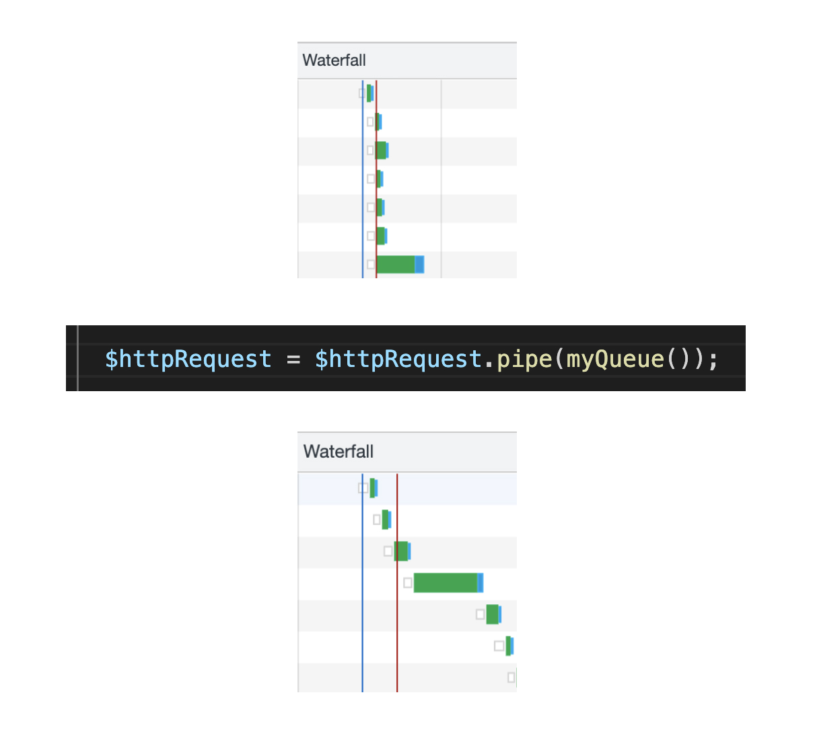

# RXJS queued

> A factory to create a queue operator that stacks multiple observables from different streams

It will postpone the subscription of next observable until the previous observable is completed.

It can be shared across different kind of streams.

## Motivation

I was working on an Angular application where certain backend endpoints could not be called concurrently due to a flawed backend architecture.

Subscriptions to these api endpoints were coming from different angular components/services so I wanted to find an elegant solution to sync these HTTP requests using a queue.



## [Example](https://gustavorino.github.io/rxjs-queued/)

## Installation

```bash
$ npm install rxjs-queued
```

## Usage

```js
import createQueue from 'rxjs-queued';

const queue = createQueue();

const stream1$ = of(1).pipe(delay(500), queue());
const stream2$ = of(2).pipe(delay(500), queue());
const stream3$ = of(3).pipe(
  delay(500),
  tap(() => {
    throw new Error('ops');
  }),
  queue()
);
const stream4$ = of(4).pipe(delay(500), queue());

stream1$.subscribe((v) => {
  console.log('stream1$', v);
});
stream2$.subscribe((v) => {
  console.log('stream2$', v);
});
stream3$.subscribe((v) => {
  console.log('stream3$', v);
});
stream4$.subscribe((v) => {
  console.log('stream4$', v);
});

/*
Output       |  Time
stream1$ 1   |  500ms
stream2$ 2   |  1000ms
Error: ops   |  1500ms
stream4$ 4   |  2000ms
*/
```
